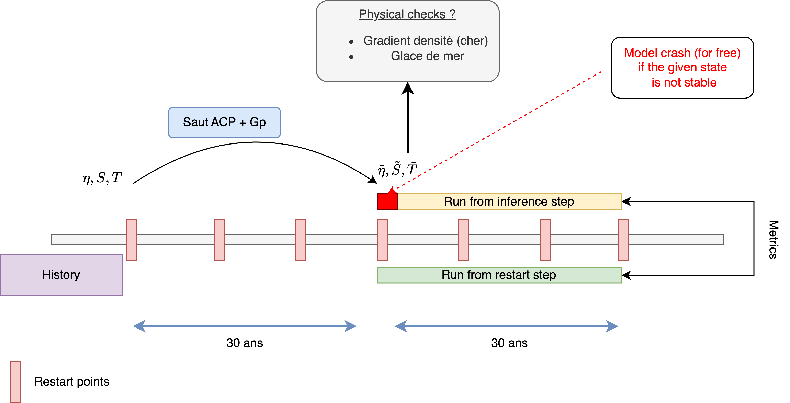
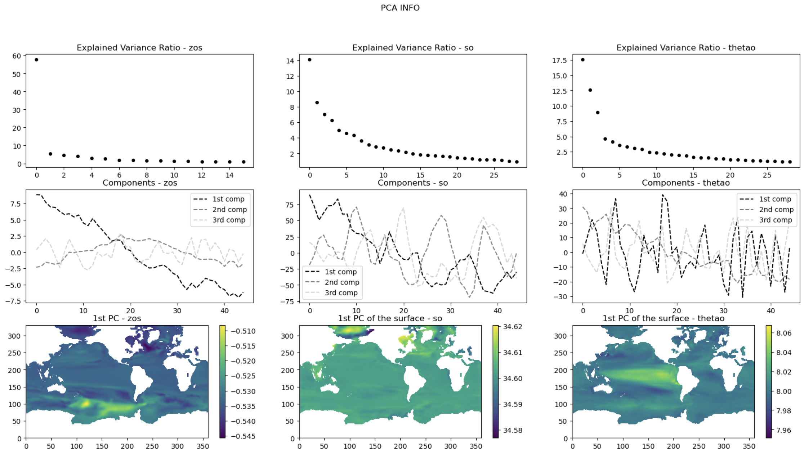

hange cumsum axis = 1
change update_rho -> thetao_new => Restart["tn"]
# EMULATOR FRO NEMO MODEL

Add retstart and prepare 

# Jumper.ipynb

### *Prepare and forecast simulations* 

The objective is to implement a Gaussian process forecast to forecast yearly simulations of NEMO coupled climate model. For this we need simulations files of the sea surface height (zos or ssh), the salinity (so) and temperature (thetao). 

We apply PCA on each simulation to transform those features to time series. And we observe the trend in the first component.

We forecast each component with a Gaussian process with the following kernel.
- Long term trend   :  0.1*DotProduct(sigma_0=0.0) 
- Periodic patterns : 10 * ExpSineSquared(length_scale=5/45, periodicity=5/45)#0.5**2*RationalQuadratic(length_scale=5.0, alpha=1.0) + 10 * ExpSineSquared(length_scale=5.0)
- White noise       : 2*WhiteKernel(noise_level=1)

     

And we evaluate the RMSE 

# Restart.ipynb

### *Update of restart files for NEMO* 

The objective is to update the last restart file to initialize the jump. For this we need the 340 restarts files of the last simulated year. We also need the predictions of the sea surface height (zos or ssh), the salinity (so) and temperature (thetao). We also need the Mask dataset of the corresponding simulation where several informations are needed.

### 1 - Predicted features  
- zos        : Predicted sea surface height (ssh) - grid T - t,y,x  
- so         : Predicted salinity - grid T - t,z,y,x  
- thetao     : Predicted temperature - grid T - t,z,y,x

### 2 - Maskdataset  
**The Maskdataset contains mask on all grids, vectors and constants**
  
- dimensions t:1 y:331 x:360 z:75  
- umask : continent mask for u grid (continent : 0, sea : 1)  
- vmask : continent mask for v grid (continent : 0, sea : 1)
- e3t_0 : initial thickness of cell on z axis on grid T  (e:thickness, i:direction, t:grid, 0:initial state / ref) = e3t_ini restart
- e2t   : thickness of cell on y axis on grid T  
- e1t   : thickness of cell on y axis on grid T
- ff_f  : corriolis force 

### 3 - Necessary features to update restart
This is the list of features from the source restart file we need to exploit to update restart. 

- e3t : e3t_ini*(1+tmask4D*np.expand_dims(np.tile(ssh*ssmask/(bathy+(1-ssmask)),(75,1,1)),axis=0))
- deptht : depth of the z axis - grid T
- bathy  : np.ma.sum(e3t,axis=1)

### 4 - Restart file update
**The restart files contains all physical and dynamical features of the simulation**
  
There is a total of 340 restart file per year. Each file contains a slice of x and y dimensions. Each files contains 58 data variables which 15 are updates using the predictions  
  

**NB** : difference between now (n) and before (b) arrays : they represent the same states, in practice the restart file save two successive states. In our code we set the two to the same state to use euler forward for the restart. 

- ssh(n/b) :  sea surface height       => last prediction of zos
- s(n/b)   :  sea salinity             => last prediction of so
- t(n/b)   :  sea temperature          => last prediction of thetao
- v(n/b)   :  zonal velocity           => *The planetary ocean* by Michèle Fieux p70
$$V(z)=\frac{g}{p \cdot f} \cdot \int_{z_0}^{Z} \frac{\partial \rho}{\partial x}dz + V_O$$
- u(n/b)   :  meridional velocity      => *The planetary ocean* by Michèle Fieux p70
$$U(z)=\frac{g}{p \cdot f} \cdot \int_{z_0}^{Z} \frac{\partial \rho}{\partial y}dz + U_O$$
- sss_m : sea surface salinity     => last prediction of so
- sst_m : sea surface temperature  => last prediction of thetao
- ssu_m : sea surface u velocity   => From new u
- ssv_m : sea surface v velocity   => From new v
- rhop  : Potential density referenced to pressure n*1000dB (kg/m**3) - Equation of state of Sea-water and related utilities by Julien Le Sommer / can be regularized

Grid infos :

Grid T : variables scalaires
U
V
W
F

# main

### *Prepare and forecast simulations and initialize restarts files with one command line* 
Prepare, forecats and predict
NB : En amont code de Guillaume pour obtenir des moyennes annuelles 

#python main.py --ye True --start 25 --end 65 --comp 0.9 --steps 30 --path /scratchu/mtissot/SIMUp6Y

- ye    : la simulation est en années
- start : année de départ pour la selection des données d'entrainement
- end   : année de fin (generalement la dernière année simulée)
- comp  : Nombre/ratio de composantes à accelerer
- steps : taille du saut (en année si ye = True sinon en mois)
- path  : adresse du fichier de simulations

## Steps for running Spin-Up NEMO

1. Run DINO for 50-100 years. Slurm script has been provided in NEMO [notes](https://github.com/m2lines/Spinup-NEMO-notes/blob/main/nemo/buildandrun_NEMODINO.md). If we need to train on more data we then need to concatentate simulation outputs `*grid_T.nc` using `ncrcat`. 

2. Create a virtual environment, for example, with conda. Then install the requirements within it using `pip install -r requirements.txt`

3. Run the resampling **notebook** on `DINO_1m_grid_T.nc` (See [run_with_DINO_data](https://github.com/m2lines/Spinup-NEMO/tree/run_with_DINO_data) branch). This is the [Notebook](https://github.com/m2lines/Spinup-NEMO/blob/resample_dino_data/Notebooks/Resample_ssh.ipynb)   
  This notebook converts DINO 2d monthly SSH output `DINO_1m_grid_T.nc` to annual `DINO_1m_To_1y_grid_T.nc`. Temperature and salinity (3D) are sampled annually already and are in `DINO_1y_grid_T.nc`. We can then read these files in the updated notebook for DINO. 
4. Run the updated `Jumper.ipynb` **notebook** and to create the projected state. 
    1. In the Jumper Notebook set the `path` to the directory of the NEMO/DINO (Grid) data: 
    

5. Prepare restart file:
   Combine `mesh_mask_[0000].nc` files and `DINO_[<time>]_restart_[<process>].nc` (last files) using **[REBUILD_NEMO](https://forge.nemo-ocean.eu/nemo/nemo/-/tree/4.2.0/tools/REBUILD_NEMO)** tools
6.
   In the directory which holds your nemo data
   Create a new restart file by running `main_restart.py`.
  `python main_restart.py --restart_path "path/to/restart/file/directory" --radical DINO_[<time>]_restart --mask_file /path/to/mesh_mask.nc --prediction_path /path/to/simus_predicted`
    `main_restart.py` 
    This script has been modified to work on DINO data. This is in the [run_with_DINO_data](https://github.com/m2lines/Spinup-NEMO/tree/run_with_DINO_data) branch.
    This creates an updated Restart file with the same names as the original but with 'NEW' prepended at the front.
    
7. Within the NEMO repository make a copy of DINO experiment directory. Delete old NEMO output files from the original experiment directory (mesh mask, restart files, grid files etc). The copy serves as a backup as data is overwritten on each run.
8. Copy mesh mask and restart file to the original experiment directory
9. Namelist config need to be updated:
Open namelist_cfg and amend the following under namrun:

-    nn_it000 (the first timestep) (The last timestep +1)
-    nn_itend (the final timestep)
- cn_ocerst_in (the restart name syntax - to coincide with the latest restart file)
- ln_rstart (start from rest(F) or from a restart file (T).
 
 
10. Restart DINO with updated restart file.
