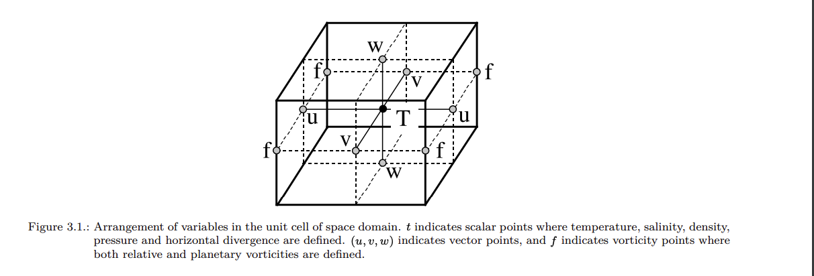

# Jumper.ipynb

### *Prepare and forecast simulations* 
The objective is load yearly and standardize simulations to implement a Gaussian process forecast. For this we need simulations files of the sea surface height (zos or ssh), the salinity (so) and temperature (thetao). 

We apply PCA on each simulation to transform those features to time series. And we observe the trend in the first component.

We forecast each component with a Gaussian process with the following kernel.
- Long term trend :  0.1*DotProduct(sigma_0=0.0) 
- Periodic patterns  = 10 * ExpSineSquared(length_scale=5/45, periodicity=5/45)#0.5**2*RationalQuadratic(length_scale=5.0, alpha=1.0) + 10 * ExpSineSquared(length_scale=5.0)
- White noise = 2*WhiteKernel(noise_level=1)

     

And we evaluate the RMSE 

# Restart.ipynb

### *Update of restart files for NEMO* 

The objective is to update the last restart file to initialize the jump. For this we need the 340 restarts files of the last simulated year. We also need the predictions of the sea surface height (zos or ssh), the salinity (so) and temperature (thetao). We also need the Mask dataset of the corresponding simulation where several informations are needed.

### 1 - Predicted features  
- zos        : Predicted sea surface height (ssh) - grid T - t,y,x  
- so         : Predicted salinity - grid T - t,z,y,x  
- thetao     : Predicted temperature - grid T - t,z,y,x

### 2 - Maskdataset  
**The Maskdataset contains mask on all grids, vectors and constants**
  
- dimensions t:1 y:331 x:360 z:75  
- umask : continent mask for u grid (continent : 0, sea : 1)  
- vmask : continent mask for v grid (continent : 0, sea : 1)
- e3t_0 : initial thickness of cell on z axis on grid T  (e:thickness, i:direction, t:grid, 0:initial state / ref) = e3t_ini restart
- e2t   : thickness of cell on y axis on grid T  
- e1t   : thickness of cell on y axis on grid T
- ff_f  : corriolis force 

### 3 - Necessary features to update restart
- e3t : e3t_ini*(1+tmask4D*np.expand_dims(np.tile(ssh*ssmask/(bathy+(1-ssmask)),(75,1,1)),axis=0))
- deptht : depth of the z axis - grid T
- bathy  : np.ma.sum(e3t,axis=1)

### 4 - Restart file update
**The restart files contains all physical and dynamical features of the simulation**
  
There is a total of 340 restart file per year. Each file contains a slice of x and y dimensions. Each files contains 58 data variables which 15 are updates using the predictions  
  
difference of now (n) and before (b): les même états : Le restart n'a besoin que d'une image - flou euler forward (t->t+1) diff simu en cours plusieurs pas de temps***

- ssh(n/b) :  sea surface height       => last prediction of zos
- s(n/b)   :  sea salinity             => last prediction of so
- t(n/b)   :  sea temperature          => last prediction of thetao
- v(n/b)   :  zonal velocity           => *The planetary ocean* by Michèle Fieux p70
$$V(z)=\frac{g}{p \cdot f} \cdot \int_{z_0}^{Z} \frac{\partial \rho}{\partial x}dz + V_O$$
- u(n/b)   :  meridional velocity      => *The planetary ocean* by Michèle Fieux p70
$$U(z)=\frac{g}{p \cdot f} \cdot \int_{z_0}^{Z} \frac{\partial \rho}{\partial y}dz + U_O$$
- sss_m : sea surface salinity     => last prediction of so
- sst_m : sea surface temperature  => last prediction of thetao
- ssu_m : sea surface u velocity   => From new u
- ssv_m : sea surface v velocity   => From new v
- rhop  : Potential density referenced to pressure n*1000dB (kg/m**3) - Equation of state of Sea-water and related utilities by Julien Le Sommer / can be regularized

Grid infos :

Grid T : variables scalaires
U
V
W
F

# main

### *Prepare and forecast simulations and initialize restarts files with one command line* 
Prepare, forecats and predict
NB : En amont code de Guillaume pour obtenir des moyennes annuelles 

#python main.py --ye True --start 25 --end 65 --comp 0.9 --steps 30 --path /scratchu/mtissot/SIMUp6Y

- ye    : la simulation est en années
- start : année de départ pour la selection des données d'entrainement
- end   : année de fin (generalement la dernière année simulée)
- comp  : Nombre/ratio de composantes à accelerer
- steps : taille du saut (en année si ye = True sinon en mois)
- path  : adresse du fichier de simulations
